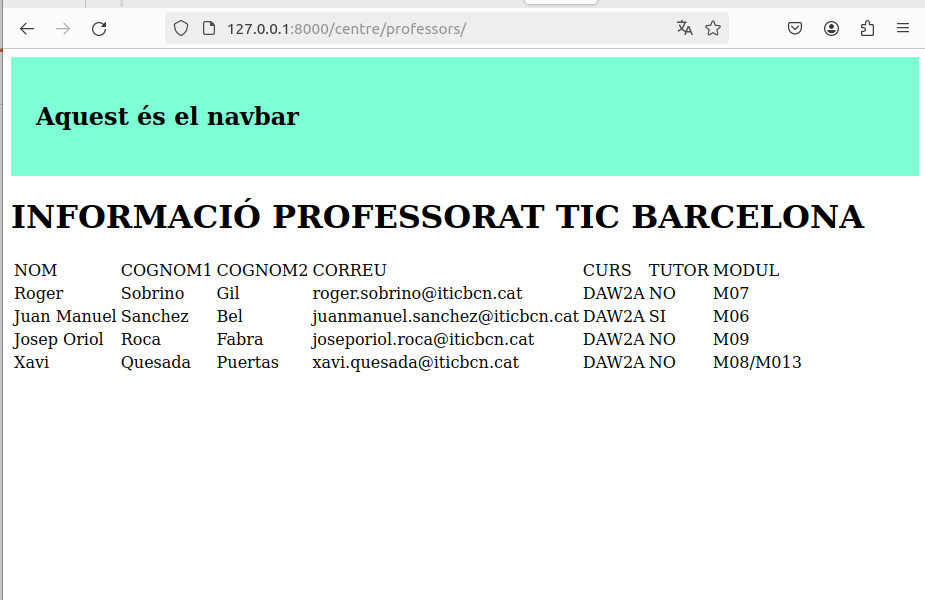

# Practica 1

# PART 1

# PART 2
[Link del video](PracticaDjango1.webm)

# Practica 2

# VIDEO
[Link del video](migraciouf4.webm)

# Practica 3

# Practica 4 

<h2>CRUD PROFESSORAT</h2>
CREATE

READ

UPDATE

DELETE

DETAILS

<h2>CRUD ALUMNAT</h2>

<h2> VIDEO PRACTICA 4 </h2>

[Link del video](videoCrud.webm)
